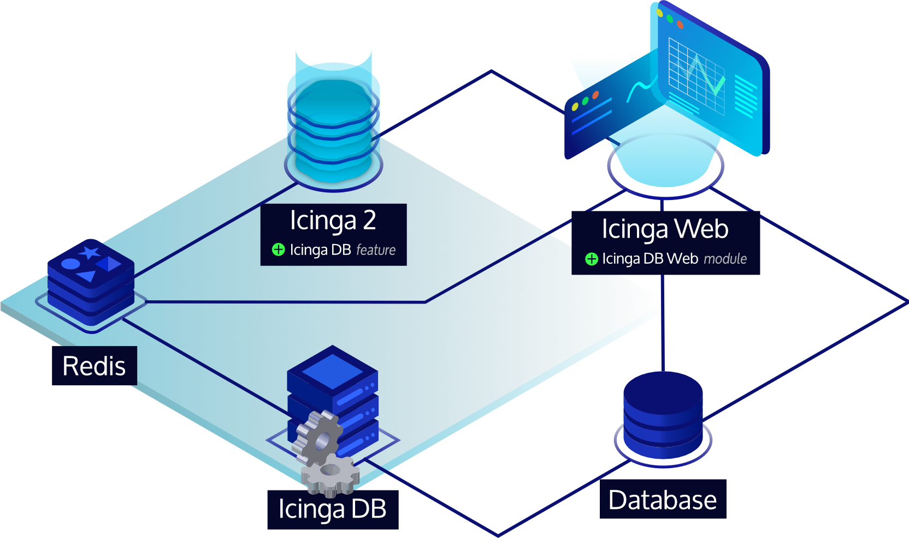

# Icinga DB

Icinga DB is a set of components for publishing, synchronizing and
visualizing monitoring data in the Icinga ecosystem, consisting of:

* The Icinga DB daemon,
  which synchronizes monitoring data between a Redis®[\*](doc/TRADEMARKS.md#redis) server and a database
* Icinga 2 with its [Icinga DB feature](https://icinga.com/docs/icinga-2/latest/doc/14-features/#icinga-db) enabled,
  responsible for publishing the data to the Redis® server, i.e. configuration and its runtime updates, check results,
  state changes, downtimes, acknowledgements, notifications, and other events such as flapping
* And Icinga Web with the
  [Icinga DB Web](https://icinga.com/docs/icinga-db-web) module enabled,
  which connects to both Redis® and the database to display and work with the most up-to-date data

## Documentation

Icinga DB documentation is available at [icinga.com/docs](https://icinga.com/docs/icinga-db).

## License

Icinga DB and the Icinga DB documentation are licensed under the terms of the
[GNU General Public License Version 2](LICENSE).
