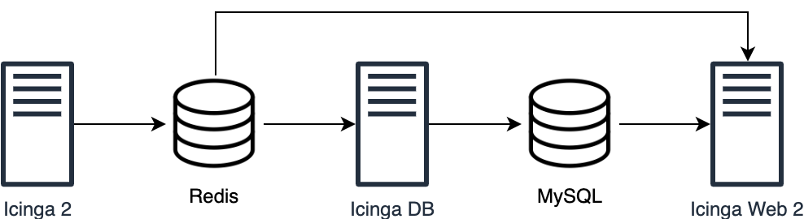

# Icinga DB

Icinga DB serves as a synchronisation daemon between Icinga 2 (Redis) and Icinga Web 2 (MySQL). It synchronises configuration, volatile states and history of an Icinga 2 environment using checksums.

Icinga DB also supports reading from multiple environments and writing into a single MySQL instance.