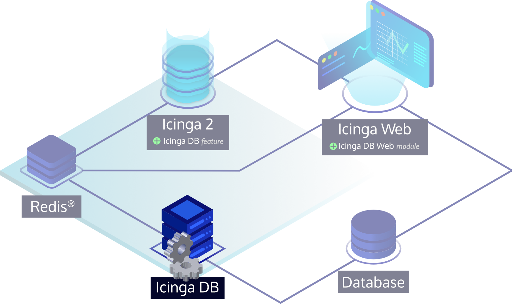
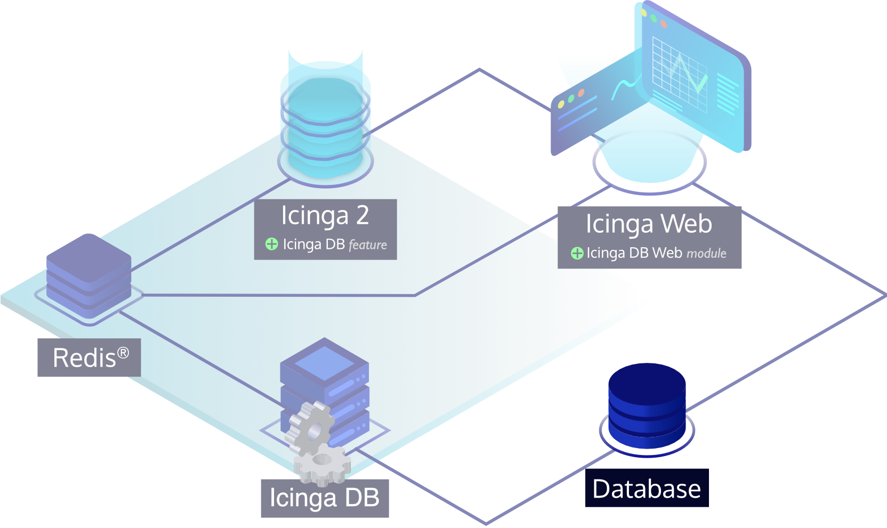
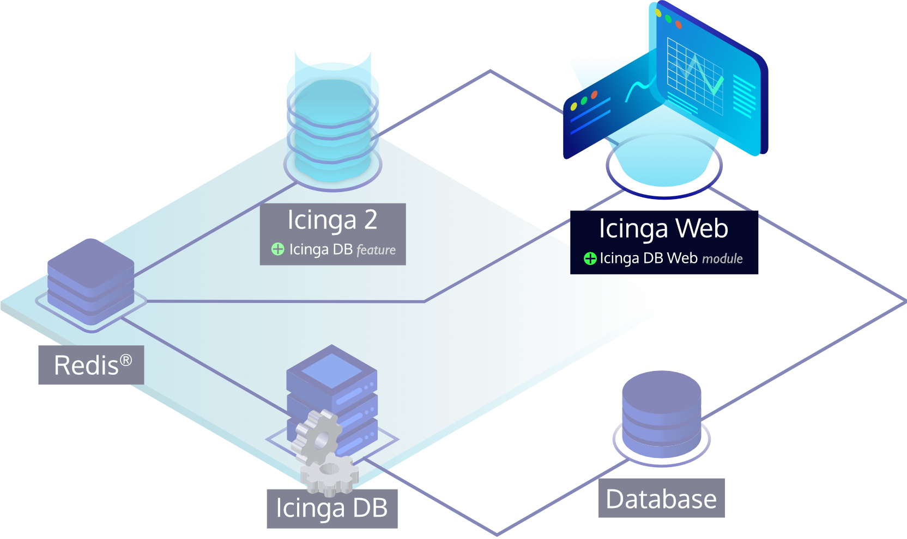

<!--  -->
# Installing Icinga DB

The recommended way to install Icinga DB is to use prebuilt packages for
all supported platforms from our official release repository.
Please follow the steps listed for your target operating system,
which guide you through setting up the repository and installing Icinga DB.

To upgrade an existing Icinga DB installation to a newer version,
see the [Upgrading](04-Upgrading.md) documentation for the necessary steps.



Before installing Icinga DB, make sure you have installed [Icinga 2](https://icinga.com/docs/icinga-2),
set up a Redis server, and enabled the `icingadb` feature.
The Icinga 2 installation documentation covers all the necessary steps.
Additionally, Icinga offers the `icingadb-redis` package for all supported operating systems,
which ships an up-to-date Redis server version and is pre-configured for the Icinga DB components.

!!! tip

    Although Icinga DB can run anywhere in an Icinga environment,
    we recommend to install it where the corresponding Icinga 2 node and Redis server is running to
    keep latency between the components low.

<!--  -->
## Adding Icinga Package Repository

The recommended way to install Icinga DB is to use prebuilt packages from our official release repository.

!!! tip

    If you install Icinga DB on a node that has Icinga 2 or Icinga Web installed via packages,
    proceed to [installing the Icinga DB package](#installing-icinga-db-web-package) as
    the repository is already configured.

Here's how to add the official release repository:

<!--  -->
<!--  -->
### Amazon Linux 2 Repository
<!--  -->
!!! info

    A paid repository subscription is required for Amazon Linux 2 repositories. Get more information on
    [icinga.com/subscription](https://icinga.com/subscription).

    Don't forget to fill in the username and password section with appropriate credentials in the local .repo file.

```bash
rpm --import https://packages.icinga.com/icinga.key
wget https://packages.icinga.com/subscription/amazon/ICINGA-release.repo -O /etc/yum.repos.d/ICINGA-release.repo
```
<!--  -->

<!--  -->
<!--  -->
### CentOS Repository
<!--  -->
```bash
rpm --import https://packages.icinga.com/icinga.key
wget https://packages.icinga.com/centos/ICINGA-release.repo -O /etc/yum.repos.d/ICINGA-release.repo
```
<!--  -->

<!--  -->
<!--  -->
### Debian Repository
<!--  -->

```bash
apt update
apt -y install apt-transport-https wget gnupg

wget -O - https://packages.icinga.com/icinga.key | apt-key add -

DIST=$(awk -F"[)(]+" '/VERSION=/ {print $2}' /etc/os-release); \
 echo "deb https://packages.icinga.com/debian icinga-${DIST} main" > \
 /etc/apt/sources.list.d/${DIST}-icinga.list
 echo "deb-src https://packages.icinga.com/debian icinga-${DIST} main" >> \
 /etc/apt/sources.list.d/${DIST}-icinga.list

apt update
```
<!--  -->

<!--  -->
<!--  -->
### RHEL Repository
<!--  -->
!!! info

    A paid repository subscription is required for RHEL repositories. Get more information on
    [icinga.com/subscription](https://icinga.com/subscription).

    Don't forget to fill in the username and password section with appropriate credentials in the local .repo file.

```bash
rpm --import https://packages.icinga.com/icinga.key
wget https://packages.icinga.com/subscription/rhel/ICINGA-release.repo -O /etc/yum.repos.d/ICINGA-release.repo
```
<!--  -->

<!--  -->
<!--  -->
### SLES Repository
<!--  -->
!!! info

    A paid repository subscription is required for SLES repositories. Get more information on
    [icinga.com/subscription](https://icinga.com/subscription).

    Don't forget to fill in the username and password section with appropriate credentials in the local .repo file.

```bash
rpm --import https://packages.icinga.com/icinga.key

wget https://packages.icinga.com/subscription/sles/ICINGA-release.repo -O /etc/zypp/repos.d/ICINGA-release.repo
```

Now edit your `/etc/zypp/repos.d/ICINGA-release.repo` file with your credentials.

```
zypper ref
```
<!--  -->

<!--  -->
<!--  -->
### Ubuntu Repository
<!--  -->

```bash
apt update
apt -y install apt-transport-https wget gnupg

wget -O - https://packages.icinga.com/icinga.key | apt-key add -

. /etc/os-release; if [ ! -z ${UBUNTU_CODENAME+x} ]; then DIST="${UBUNTU_CODENAME}"; else DIST="$(lsb_release -c| awk '{print $2}')"; fi; \
 echo "deb https://packages.icinga.com/ubuntu icinga-${DIST} main" > \
 /etc/apt/sources.list.d/${DIST}-icinga.list
 echo "deb-src https://packages.icinga.com/ubuntu icinga-${DIST} main" >> \
 /etc/apt/sources.list.d/${DIST}-icinga.list

apt update
```
<!--  -->

## Installing Icinga DB Package

Use your distribution's package manager to install the `icingadb` package as follows:

<!--  -->
<!--  -->
#### Amazon Linux 2
<!--  -->
```bash
yum install icingadb
```
<!--  -->

<!--  -->
<!--  -->
#### CentOS
<!--  -->
!!! info

    Note that installing Icinga DB is only supported on CentOS 7 as CentOS 8 is EOL.

```bash
yum install icingadb
```
<!--  -->

<!--  -->
<!--  -->
#### Debian / Ubuntu
<!--  -->
```bash
apt install icingadb
```
<!--  -->

<!--  -->
#### RHEL 8 or Later

```bash
dnf install icingadb
```

#### RHEL 7

```bash
yum install icingadb
```
<!--  -->

<!--  -->
<!--  -->
#### SLES
<!--  -->
```bash
zypper install icingadb
```
<!--  -->

## Setting up the Database

A MySQL (≥5.5), MariaDB (≥10.1), or PostgreSQL (≥9.6) database is required to run Icinga DB.
Please follow the steps listed for your target database,
which guide you through setting up the database and user and importing the schema.



!!! info

    In high availability setups, all Icinga DB instances must write to the same database.

### Setting up a MySQL or MariaDB Database

If you use a version of MySQL < 5.7 or MariaDB < 10.2, the following server options must be set:

```
innodb_file_format=barracuda
innodb_file_per_table=1
innodb_large_prefix=1
```

Set up a MySQL database for Icinga DB:

```
# mysql -u root -p

CREATE DATABASE icingadb;
CREATE USER 'icingadb'@'localhost' IDENTIFIED BY 'CHANGEME';
GRANT ALL ON icingadb.* TO 'icingadb'@'localhost';
```

After creating the database, import the Icinga DB schema using the following command:

```
mysql -u root -p icingadb </usr/share/icingadb/schema/mysql/schema.sql
```

### Setting up a PostgreSQL Database

Set up a PostgreSQL database for Icinga DB:

```
# su -l postgres

createuser -P icingadb
createdb -E UTF8 --locale en_US.UTF-8 -T template0 -O icingadb icingadb
psql icingadb <<<'CREATE EXTENSION IF NOT EXISTS citext;'
```

The `CREATE EXTENSION` command requires the `postgresql-contrib` package.

Edit `pg_hba.conf`, insert the following before everything else:

```
local all icingadb           md5
host  all icingadb 0.0.0.0/0 md5
host  all icingadb      ::/0 md5
```

To apply these changes, run `systemctl reload postgresql`.

After creating the database, import the Icinga DB schema using the following command:

```
psql -U icingadb icingadb < /usr/share/icingadb/schema/pgsql/schema.sql
```

## Configuring Icinga DB

Icinga DB installs its configuration file to `/etc/icingadb/config.yml`,
pre-populating most of the settings for a local setup. Before running Icinga DB,
adjust the Redis and database credentials and, if necessary, the connection configuration.
The configuration file explains general settings.
All available settings can be found under [Configuration](03-Configuration.md).

## Running Icinga DB

The `icingadb` package automatically installs the necessary systemd unit files to run Icinga DB.
Please run the following command to enable and start its service:

```bash
systemctl enable --now icingadb
```

## Installing Icinga DB Web

With Icinga 2, Redis, Icinga DB and the database fully set up, it is now time to install Icinga DB Web,
which connects to both Redis and the database to display and work with the monitoring data.



The Icinga DB Web package is also included in the Icinga repository, and since it is already set up,
you have completed the instructions here and can proceed to
<!--  -->
[installing Icinga DB Web on Amazon Linux](https://icinga.com/docs/icinga-db-web/latest/doc/02-Installation/01-Amazon-Linux/#installing-icinga-db-web-package),
<!--  -->
<!--  -->
[installing Icinga DB Web on CentOS](https://icinga.com/docs/icinga-db-web/latest/doc/02-Installation/02-CentOS/#installing-icinga-db-web-package),
<!--  -->
<!--  -->
[installing Icinga DB Web on Debian](https://icinga.com/docs/icinga-db-web/latest/doc/02-Installation/03-Debian/#installing-icinga-db-web-package),
<!--  -->
<!--  -->
[installing Icinga DB Web on RHEL](https://icinga.com/docs/icinga-db-web/latest/doc/02-Installation/04-RHEL/#installing-icinga-db-web-package),
<!--  -->
<!--  -->
[installing Icinga DB Web on SLES](https://icinga.com/docs/icinga-db-web/latest/doc/02-Installation/05-SLES/#installing-icinga-db-web-package),
<!--  -->
<!--  -->
[installing Icinga DB Web on Ubuntu](https://icinga.com/docs/icinga-db-web/latest/doc/02-Installation/06-Ubuntu/#installing-icinga-db-web-package),
<!--  -->
which will also guide you through the setup of the Icinga Web PHP framework,
which is required to run the Icinga DB web module.
Below is a preview of how the interface visualizes monitoring data and also supports dark and light mode:


<!--  --><!-- {# end else if index #} -->
