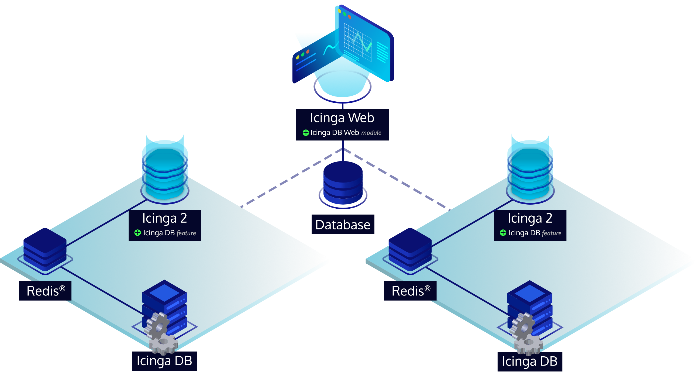
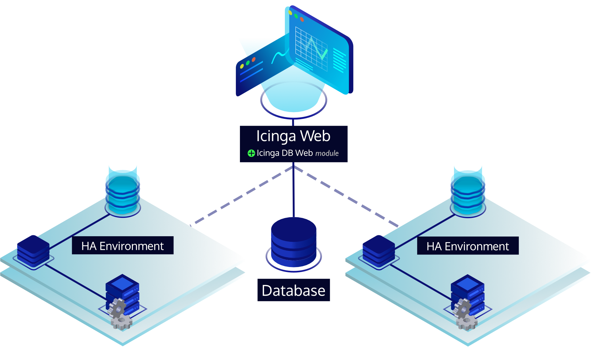

# Distributed Setups

## High Availability

High availability functionality is built directly into Icinga DB and
can be deployed without additional third-party components.

First, you need an Icinga 2 high availability setup with two master nodes, such as described
[here](https://icinga.com/docs/icinga-2/latest/doc/06-distributed-monitoring#high-availability-master-with-agents).

Each of the master nodes must have the Icinga DB feature enabled and
have their own dedicated Redis® server set up for it, so that each node writes the monitoring data separately.
The setup steps per node are no different from a single node setup and can be found in the
[Icinga 2 installation documentation](https://icinga.com/docs/icinga-2/latest/doc/02-installation).
Each Redis® server will always have the complete data available as long as
its corresponding Icinga 2 master is running and writing to its Redis®.
This is because the Icinga 2 master nodes synchronize their data and events with each other as long as
they are connected,
and each takes over the entire configuration in case the other node or their connection to each other fails.

For each Redis® server you need to set up its own dedicated Icinga DB instance that connects to it,
but the Icinga DB instances must write to the same database, which of course can be replicated or a cluster.
So the steps from the standard
[Icinga DB installation documentation](https://icinga.com/docs/icinga-db/latest/doc/02-Installation/)
can be followed. However, as mentioned, the database only needs to be set up once.

All in all, an Icinga DB HA environment involves setting up two Icinga 2 master nodes, two Redis® servers,
two Icinga DB instances and one database.

Please read the note about the [environment ID](#environment-id),
which is common to all Icinga DB components and generated by Icinga 2's Icinga DB feature.

There is only one Icinga DB instance at a time,
which is responsible for performing database operations in the following areas:

* Synchronizing configuration, also across Icinga 2 restarts.
* Performing configuration runtime updates made via the Icinga 2 API.
* Updating recent host and service states.
* Flagging hosts and services that are overdue for updates.
* Deleting history items that have exceeded their configured retention time.

However, both Icinga DB instances write all events relevant to the history of hosts and services to the database.
This way, no data is lost if one of the Icinga 2 masters is unavailable or if their connection to each other fails.

Which Icinga DB instance is responsible is determined by a specific database operation that
can only be performed by one instance first.
In the case of concurrent operations, simply put, only one wins via a locking mechanism.
Of course, this is only true if the environment is healthy.
Icinga DB is not trying to be responsible if its corresponding Redis® server is unavailable or
Icinga 2 is not writing data to Redis®.
If Icinga 2 or Redis® become unavailable for more than 60 seconds,
Icinga DB releases responsibility so the other instance can take over.

## Multiple Environments

Icinga DB supports synchronization of monitoring data from multiple different Icinga environments into
a single database. This allows Icinga DB Web to provide a centralized view of the data.
Although everything is prepared in Icinga DB, there is no full support in Icinga DB Web yet.
As soon as it is ready, the documentation will be adapted and the feature will be explained in more detail.

## Environment ID

!!! important

    Icinga 2 generates a unique environment ID from its CA certificate when it is first started with the
    Icinga DB feature enabled. The ID is used in all Icinga DB components to separate data from
    multiple different environments and is written to the file `/var/lib/icinga2/icingadb.env` by Icinga 2.

    It is strictly recommended not to change this ID afterwards, as all data would be resynchronized and
    the old ones would remain in the database, resulting in duplicate data. As long as the file remains,
    Icinga 2 will not regenerate the environment ID. This is also true if the CA is changed to avoid duplicate data.
    Special care should be taken if you add or redeploy the master node(s) and
    as a result or over time the CA has changed, which would result in a new environment ID.
    If this is the case, make sure you copy the file between your Icinga 2 masters to get a consistent ID.

    For high-availability setups, it is a good idea to enable the Icinga DB feature on the secondary master after
    you have successfully connected from/to the primary master so that the certificates are set up properly.
    The secondary master will then generate the same environment ID since it is working with the same CA certificate.

    In any case make sure that the file `/var/lib/icinga2/icingadb.env` does not change over time and
    is the same on all Icinga 2 master nodes per environment.
