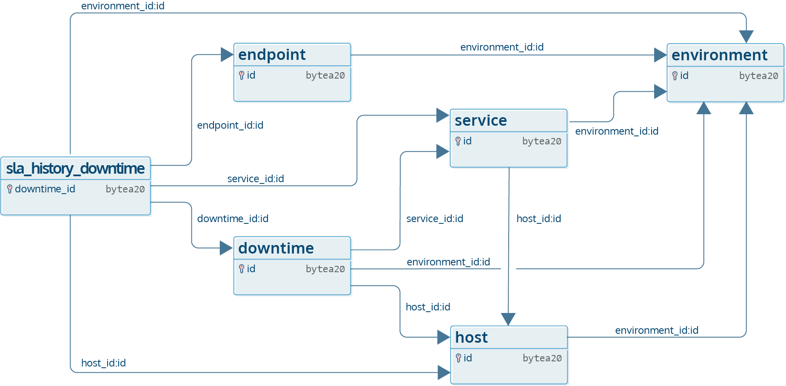
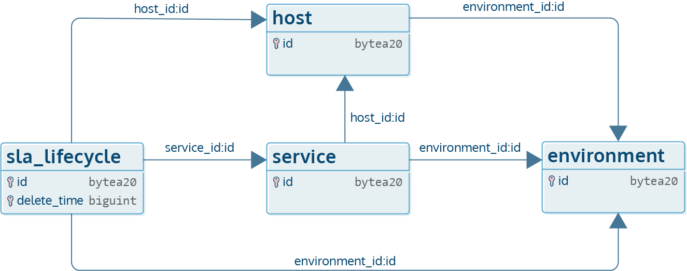

# SLA Reporting

A Service Level Agreement (SLA) is a legally binding contract between a service provider and a customer.
Its purpose is to define the level of service that the supplier promises to deliver to the customer.

Icinga DB is designed to automatically identify and record the most relevant checkable events exclusively in a separate
table. By default, these events are retained forever unless you have set the retention
[`sla-days` option](03-Configuration.md#retention). It is important to note that Icinga DB records the raw events in
the database without any interpretation. In order to generate and visualise SLA reports of specific hosts and services
based on the accumulated events over time, [Icinga Reporting](https://icinga.com/docs/icinga-reporting/latest/doc/02-Installation/)
is the optimal complement, facilitating comprehensive SLA report generation within a specific timeframe.

## Technical Description

!!! info

    This documentation provides a detailed technical explanation of how Icinga DB fulfils all the
    necessary requirements for the generation of an accurate service level agreement (SLA).

Icinga DB provides a built-in support for automatically storing the relevant events of your hosts and services without
a manual action. Generally, these events are every **hard** state change a particular checkable encounters and all the
downtimes scheduled for that checkable throughout its entire lifetime. It is important to note that the aforementioned
events are not analogous to those utilised by [Icinga DB Web](https://icinga.com/docs/icinga-db-web/latest/) for
visualising host and service states.

!!! info

    [Acknowledgements](https://icinga.com/docs/icinga-2/latest/doc/08-advanced-topics/#acknowledgements) are special
    events that mainly control the Icinga 2 notification logic behaviour, and acknowledging a host problem will not
    have an impact on the SLA result for that host.

In case of a hard state change of a monitored host or service, Icinga DB records the precise temporal occurrence of
that state change in milliseconds within the `sla_history_state` table. The following image serves as a visual
illustration of the relational and representational aspects of state change events.


In contrast, two timestamps are retained for downtimes, one indicating the commencement of the downtime as
`downtime_start` and the other denoting its end time, designated as `downtime_end` within the `sla_history_downtime`
table. For the sake of completeness, the following image provides also a visual representation of the
`sla_history_downtime` table and its relations.



In certain circumstances, namely when a checkable is created and subsequently never deleted, this approach has been
empirically [demonstrated](#computing-sla-ok-percent) to be sufficient. Nevertheless, in the case of a host being
deleted and then recreated a couple of days later, the generation of SLA reports in
[Icinga Reporting](https://icinga.com/docs/icinga-reporting/latest/doc/02-Installation/) for that host at
the end of the week may yield disparate results, depending on the host state prior to its deletion.

In order to generate SLA reports with the greatest possible accuracy, we have decided to supplement the existing data
with information regarding the **creation** and **deletion** of hosts and services in a new `sla_lifecycle` table,
introduced in Icinga DB **1.3.0**. This new table has a composite primary key consisting of two columns: `id` and
`delete_time`. In this way, the `delete_time` is used to indicate whether a specific checkable has been deleted,
with a `0` value denoting non-deleted object. In a perfect world, we would use `NULL` instead of `0` but due to the
[primary key `constraints`](https://dev.mysql.com/doc/refman/8.4/en/create-table.html#create-table-indexes-keys),
this is not possible. The `id` column represents either the service or host ID for which that particular sla lifecycle
is being generated.



The upgrade script for `1.3.0` generates a `create_time` SLA lifecycle entry for all existing hosts and services.
However, since that script has no knowledge of the creation time of these existing objects, the timestamp for them is
produced in the following manner: As previously outlined, Icinga DB has the capability to store timestamps for both
hard state changes and downtimes since its first stable release. This enables the upgrade script to identify the least
event timestamp of a given checkable from the `sla_history_state` and `sla_history_downtime` tables. In cases where no
timestamps can be obtained from the aforementioned tables, it simply fallbacks to `now`, i.e. in such situations,
the creation time of the checkable in question is set to the current timestamp.

### Events Processing

It is noteworthy that Icinga DB does not record checkable **soft** state changes, in the regular `service_state`
and `host_state` tables. However, for the `state_history`, for instance, all state changes are retrieved from Redis®
and persisted to the database, irrespective of whether it is in High Availability (HA) or single-instance mode.
Each time Icinga DB processes a state change, it checks whether it is a hard state change and generates the
corresponding SLA state event in the `sla_history_state` table. Similarly, Icinga DB generates a corresponding SLA
history downtime (`sla_history_downtime`) each time it receives a downtime-triggered or ended/cancelled event from
Icinga 2. Notably, if Icinga DB is operating in HA mode, this process takes place in parallel, i.e. both instances
concurrently write their respective histories to the database, consequently, the aforementioned tables have also to
track the endpoint ids in their `endpoint_id` column.

Though, it is not necessary to be concerned about the potential duplicate entries in the database, as long as the events
from both Icinga DB instances have the same timestamp, there will be no duplicates. For instance, downtimes have unique
and deterministic IDs, allowing the second instance to detect if that very same downtime has already been recorded by
the other instance.

The checkable events of the types **created** and **deleted**, on the other hand, are special and represent the life
cycle of the chekables. These two events are always written by a single Icinga DB instance at a time (if in HA mode) to
the `sla_lifecycle` table, denoting the creation and deletion of a checkable in Icinga 2. Unfortunately, Icinga 2 lacks
the capability to accurately determine the deletion time of an object. It should also be noted that Icinga DB is also
incapable of identifying the precise timestamp of an object's deletion. Instead, it simply records the time at which
the deletion event for that particular checkable occurred and populates the `sla_lifecycle` table accordingly.
Consequently, if a checkable is deleted while Icinga DB is stopped or not in an operational state, the events that
Icinga DB would otherwise record once it is restarted will not reflect the actual deletion or creation time.

#### Initial Config Sync

Each time when either the Icinga DB or Icinga 2 service is reloaded, Icinga DB computes something called a config
`delta`. The config delta determines which objects need to be deleted from the database, to be updated, or are new and
need to be inserted. After successfully computing and dumping the config, Icinga DB then performs a simple SQL
`INSERT INTO sla_lifecycle` statements for all checkables that don't already have **created** SLA event with
`delete_time` set to `0` and sets their `create_time` to `now`. Additionally, it also updates the `delete_time` column
of each existing SLA lifecycle entries whose checkable IDs cannot be found in the `host/service` tables.

#### Runtime Updates

When a host or service is created or deleted at runtime, either using
[Icinga Director](https://icinga.com/docs/icinga-director/latest/doc/01-Introduction/) or the plain `/v1/objects` API
endpoint, Icinga DB automatically generates an SLA lifecycle entry denoting the checkable creation or deletion time.
For all runtime *created* checkables, the SLA lifecycle entries are inserted using a slightly sophisticated SQL `INSERT`
statement with ignore on error mechanism, i.e. if it encounters a `duplicate key` error, it simply suppresses the error
and discards the query. In contrast, for runtime *deleted* checkables, it assumes that there is an SLA lifecycle
**created** event for these checkables, and uses a simple `UPDATE` statement setting their deletion time to now.
Consequently, should there be no corresponding **created** event for these checkables, the update statement becomes a
no-op, as the [initial config dump](#initial-config-sync) should have created the necessary entries for all existing
objects.

### Computing SLA OK percent

The following is a simplified explanation of the current (Icinga DB `1.3.0`) methodology behind the `get_sla_ok_percent`
SQL procedure, used to calculate the SLA OK percent. It is a fundamental characteristic of functional specifications
for Icinga Reporting to only generate reports covering a specific timeframe. Accordingly, the `get_sla_ok_percent`
SQL procedure necessitates the input of the start and end timeframes within which the SLA is to be calculated.

First, it is necessary to identify the latest [`hard_state`](#hard-state-vs-previous-hard-state) of the service or host
that occurred at or prior to the timeline start date, and marking it as the initial one. In case the first query fails
to determine a `hard_state` entry, it proceeds to search for a [`previous_hard_state`](#hard-state-vs-previous-hard-state)
entry in the `sla_history_state` table that have been recorded after the start of the timeline. If this approach also
fails to retrieve the desired outcome, the regular non-historical `host_state` or `service_state` table is then
examined for the current state. Should this also produce no results, then it uses `OK` as its initial state.

Next, we need to get the total time of the specified timeframe, expressed in milliseconds, for which we're going to
compute the SLA OK percent (`total_time = timeline_end - timeline_start`).

Afterward, it traverses the entire state and downtime events within the provided timeframe, performing a series of
simple arithmetic operations. The complete algorithmic process is illustrated in the following pseudocode.

```
total_time := timeline_end - timeline_start

// Mark the timeline start date as our last event time for now.
last_event_time := timeline_start

// The problem time of a given host or service is initially set to zero.
problem_time := 0

// The previous_hard_state is determined dynamically as described above, however,
// for the purposes of this analysis, we'll just set it to 'OK'.
previous_hard_state := OK

// Loop through all the state and downtime events within the provided timeframe ordered by their timestamp.
for event in (sla_history_state, sla_history_downtime) do
    if (event.previous_hard_state is PENDING) then
        // A PENDING state event indicates that the host or service in question has not yet had a check result that
        // clearly identifies its state. Consequently, such events become irrelevant for the purposes of calculating
        // the SLA and we must exclude the duration of that PENDING state from the total time.
        total_time = total_time - (event.event_time - last_event_time)
    else if (previous_hard_state is greater than OK/UP
        AND previous_hard_state is not PENDING
        AND checkable is not in DOWNTIME) then
        // If the previous_hard_state is set to a non-OK state and the host or service in question was not in downtime,
        // we consider that time slot to be problematic and add the duration to the problem time.
        problem_time = problem_time + (event.event_time - last_event_time)
    endif

    // Set the "last_event_time" to the timestamp of the event being currently processed.
    last_event_time = event.event_time

    if (event.type is "state change event") then
        // If the event being currently processed is a state change event, we mark its
        // latest hard state as the previous one for the next iteration.
        previous_hard_state = event.hard_state
    endif
endloop
```

At this point, we now have computed the problem time of a particular host or service for a given time frame. The final
step is to determine the percentage of the remaining total time. In other words, we want to find out how much of the
total time is taken up by the problem time, so that we can obtain our final SLA OK percentage result.

```
sla_ok_percent := 100 * (total_time - problem_time) / total_time
```

The following example illustrates the practical implications of this concept. Suppose we have the following SLA events:
```json
{
    "state": [
        {"event_time": 1200, "hard_state": 2, "previous_hard_state": 0},
        {"event_time": 1500, "hard_state": 0, "previous_hard_state": 2}
    ],
    "downtime": [
        {"downtime_start": 1100, "downtime_end": 1300},
        {"downtime_start": 1400, "downtime_end": 1600}
    ]
}
```

We would now like to calculate the SLA OK percent for the timeframe from `1000` to `2000`.

```
total_time := 2000 - 1000
problem_time := 0

- 1000..1200 // in OK state (see the previous_hard_state of the first state event), so nothing to do.
- 1200..1300 // in Critical state, but was also set in downtime from (1100..1300), so here also nothing to do.
- 1300..1400 // still in Critical state and is not in downtime, so we count that time slot as a problem time.
problem_time = problem_time + 1400 - 1300

- 1400..1500 // still in critical state, but we have an active downtime during this period again, so nothing to do.
- 1500..2000 // in OK state

// So, this indicates that our host was either not in a problem state or was set
// to a downtime for 90% of the period from 1000 to 2000.
sla_ok_percent := 100 * (total_time - problem_time) / total_time
```

## Appendix

### Hard State vs. Previous Hard State

The `hard_state` column denotes the most recent hard state of the host and service.
Conversely, the `previous_hard_state` column indicates the preceding hard state that was formerly stored in the
`hard_state` column prior to the host or service transitioning to a new hard state. Please refer to the tabular
representation below for a visual representation of this information.

| previous_hard_state           | hard_state |
|-------------------------------|------------|
| PENDING (no check result yet) | OK         |
| OK                            | Warning    |
| Warning                       | Critical   |
| Critical                      | OK         |
